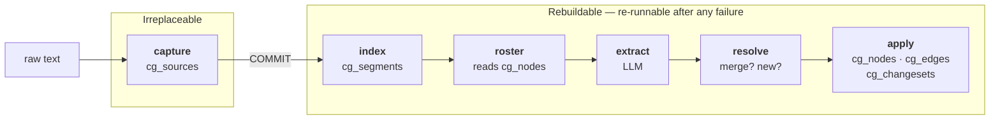
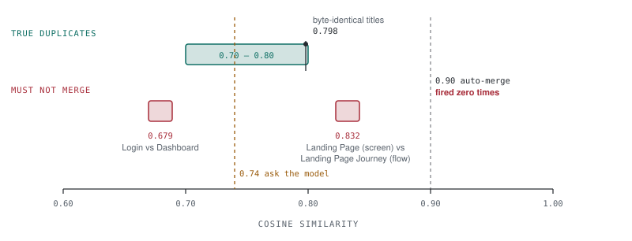
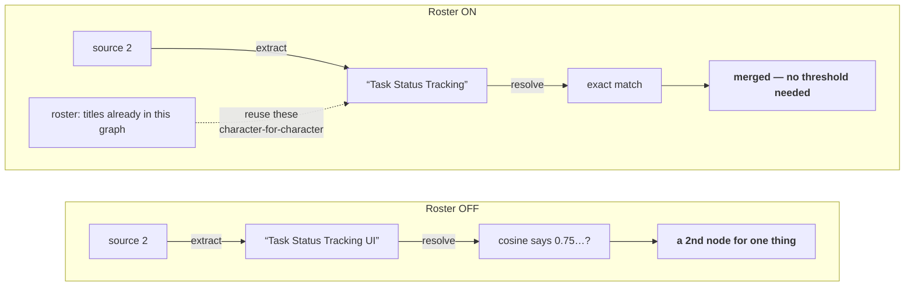
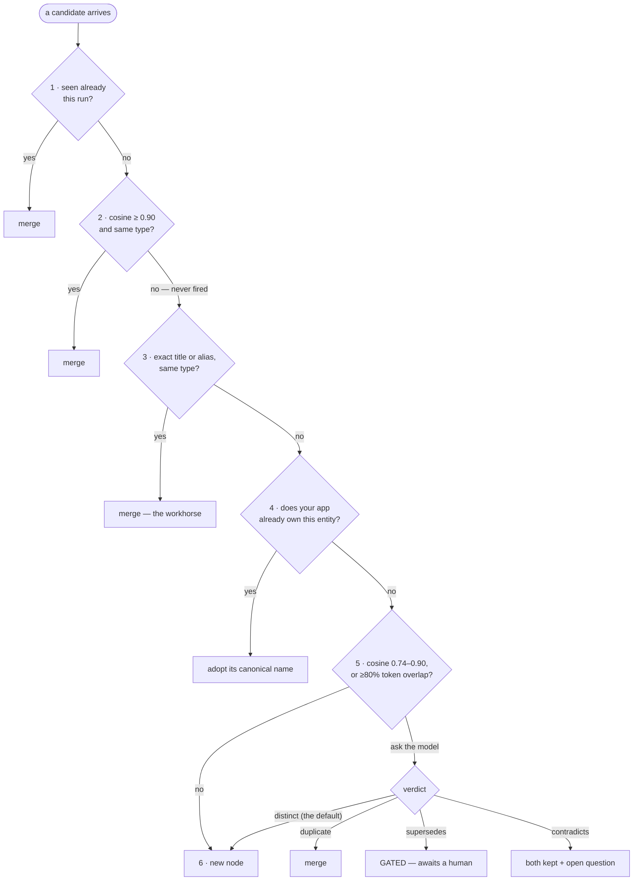
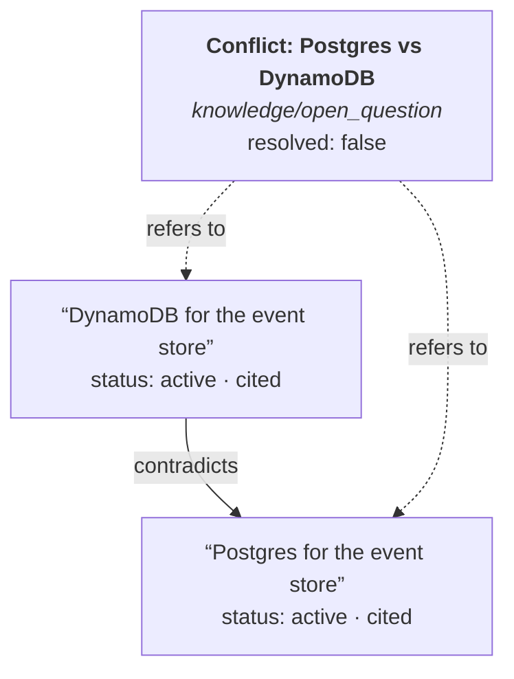
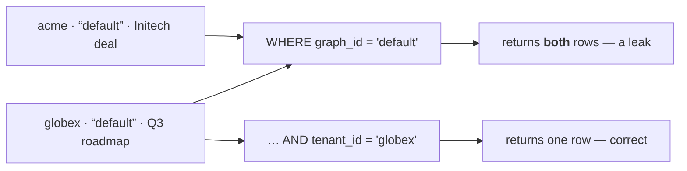

# How contextgraph works

A walkthrough of the mechanism, in the order the pipeline runs it. For the
file-by-file view see [architecture.md](architecture.md); this document is the
intuition behind it.

---

## 1. The problem it exists for

Write the same fact three times in slightly different words and a chunk store
gives you three rows. Each embeds to its own vector, each is retrieved
separately, and the agent reading them cannot tell whether it is looking at one
decision or three.

```mermaid
flowchart LR
    subgraph pile["A pile of chunks"]
        direction TB
        c1["“We chose Postgres over DynamoDB.”"]
        c2["“Postgres is confirmed for event storage.”"]
        c3["“Event store: Postgres, as agreed.”"]
    end
    pile --> out1["3 rows · 3 vectors · 1 fact<br/><b>Which one is current?</b>"]

    subgraph graph["A graph"]
        direction TB
        s1["source 1"] --> n["<b>Postgres for the event store</b><br/><i>knowledge/decision</i><br/>aliases: 2 · citations: 3"]
        s2["source 2"] --> n
        s3["source 3"] --> n
    end
    graph --> out2["1 node · every phrasing kept<br/><b>every source still cited</b>"]
```

The difference is not compression. It is that the graph *knows* these are one
decision, and can still show you all three sources it rests on.

---

## 2. The pipeline

One call — `add(tenant, graph, text)` — runs the whole thing.



The stages matter less than the line drawn after the first one. **The raw text
is committed before any paid remote call is made**, so an embedding or model
outage costs derived data — never the evidence itself.

| Failure | Outcome |
| --- | --- |
| Embedder down at capture | Source stored, unindexed. `health()["sources_unindexed"]` counts it. |
| Extraction fails | Source marked `failed` with the error; `raw_content` untouched; retryable. |
| Adjudicator fails | Fails open to "distinct" — a duplicate, which a human can merge. |
| Metering fails | Logged and ignored. The tokens are already spent. |

---

## 3. Why cosine similarity cannot decide a merge

The obvious way to de-duplicate is a threshold: score two nodes, merge above
some number. Measured against a real 100-node corpus, that does not work.

<picture>
  <source media="(prefers-color-scheme: dark)" srcset="img/similarity-band-dark.svg">
  
</picture>

Read the picture: **pairs that must stay apart sit on both sides of the
duplicate band.** The single highest-scoring pair in the entire corpus was a
screen and a flow sharing a name — exactly the merge that must never happen.
Cosine's most confident answer was its worst one.

- The 0.90 auto-merge threshold fired **zero times**.
- Two nodes with **byte-identical titles** scored **0.798**, because the
  embedded text is `title + summary` and differing summaries pull identical
  titles apart.
- Roughly **0.035** separated the highest true negative from the lowest true
  positive. There is no threshold that cleanly splits them.

Cosine *ranks* candidates here; it cannot *decide* them. So a merge needs a
second signal — and no merge ever crosses a type boundary, whatever the score.

> **The asymmetry that drives every rule.** A duplicate is annoying and
> reversible. An over-merge destroys a distinct fact and cannot be spotted by
> inspection afterwards. Every ambiguous case therefore resolves to "keep both".

---

## 4. Prevention beats detection

The threshold problem is real, but it is a symptom. The cause was measured too:
**10 of 11 near-duplicate pairs were cross-run.** The extractor had never been
shown the graph, so every pass re-invented a name for something already stored —
"Task Status Tracking" became "Task Status Tracking UI".



Showing the extractor what already exists moves de-duplication from *detection*
to *prevention*. A reused title matches on exact equality and needs no threshold
at all.

Measured A/B over two sources where the second restated the first in drifted
wording:

| | nodes after | source 2 created | merged |
|---|---|---|---|
| roster on | 5 | **0** | 5 |
| roster off | 6–7 | 1 | 4 |

The cost, stated plainly: the model can force-fit a genuinely new thing onto a
listed title. The prompt biases toward "treat it as NEW when unsure", and the
wording the source actually used is recorded as `surface_phrase`, so a force-fit
leaves a trail instead of silently attaching a claim to the wrong entity.

---

## 5. The resolution ladder

Every extracted candidate falls down this ladder until something catches it —
cheapest and most certain first.



Rung 3 does the heavy lifting and is what a threshold-only design lacks
entirely — it is the rung that catches the two byte-identical titles cosine
scored at 0.798.

A cross-type "duplicate" verdict from the model at rung 5 is **refused in code**,
not trusted to the prompt.

---

## 6. The write gate

The part with no equivalent in comparable memory systems, which write
unilaterally at ingest. Adding knowledge is free. *Changing or retiring*
knowledge that already exists is not.

| Operation | Proposed by a human | Proposed by an agent |
| --- | --- | --- |
| **Presentation** — `SET_LAYOUT` | applies | applies |
| **Additive** — `ADD_NODE`, `ADD_EDGE`, `MERGE_NODE`, `CONTRADICT` | applies | applies |
| **Truth** — `UPDATE_NODE`, `SUPERSEDE`, `DISCONNECT`, `REMOVE_NODE` | applies, with audit | **gated** |
| Anything unrecognised | gated | gated |

The verdict is computed **server-side from the operation kind and the actor**.
Whatever risk the caller claimed on the incoming operation is discarded —
otherwise anything able to construct an operation could label a supersede
"additive" and retire a claim nobody reviewed, which is the entire thing the
gate exists to prevent.

The changeset row stores the server's verdict, so what a reviewer reads and what
the gate actually did cannot disagree.

---

## 7. Nothing is ever deleted

When two claims cannot both be true, the tempting move is to pick a winner.
That is how a graph quietly becomes wrong. Instead the conflict becomes a
*thing* — a node a human can find, link to and settle.



Both rows survive. Both keep their citations. No winner is picked.

Superseding works the same way: the row stays, its status changes, and a
`supersedes` edge records what replaced it. Edges carry **valid time**
(`valid_at`/`invalid_at`, when the fact was true) and **system time**
(`created_at`/`expired_at`, when the row existed), so you can ask what was
believed, and when.

---

## 8. Two tenants, one graph name

`graph_id` is an opaque string the host chooses — so two tenants can pick the
same one, and something will, since the MCP server's own default is the literal
string `"default"`.



Every scoped statement therefore filters on **both** keys. Scope is bound when
the read service is constructed, so a method that accepts a different one does
not exist, and writes re-assert it in SQL at the point of write.

On the write path an unscoped lookup is worse than a leak: resolution decides
what a claim *merges into*, so it would fold one tenant's claim into another's
node — a write nothing downstream can distinguish from a legitimate merge.

Regression coverage: `tests/test_integration.py::TestTenantIsolation`.

---

## 9. What you get out

| Method | Answers |
| --- | --- |
| `add` | Record this |
| `recall` | What do we know about this, and how does it connect |
| `search` | What did the source material actually say |
| `neighbors` | What does this touch — impact analysis |
| `evidence` | Why do we believe this |
| `conflicts` | What do we believe that can't all be true |
| `pending` / `review` | What needs a human, and act on it |
| `health` | What is failing silently right now |

`recall` is the one an agent calls most. It locates entry nodes by similarity,
expands one hop into the connected neighbourhood, and renders a subgraph — with
node ids the model can act on, and an explicit note when anything was dropped
for length. Silent truncation reads as "this is everything".

Four Protocols carry everything host-specific — `Embedder`, `StructuredLLM`,
`Meter`, and `CanonicalResolver`, the last letting your own `screens` table stay
the authority on what screens exist. Satisfied structurally: no base class, no
registry. Swapping one is a constructor argument, not a fork. See
[extending.md](extending.md).

---

## In one sentence

**contextgraph turns text into typed, cited claims; refuses to merge two of them
without evidence stronger than a cosine score; refuses to change or retire one
without a human; and refuses to delete anything, ever.**
